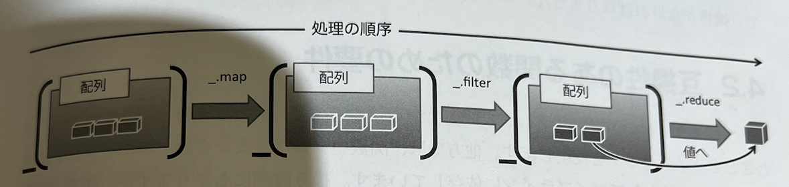

# モジュール化によるコードの再利用 ~ Toward moduler, reusable code

> ![IMPORTANT]
> モジュール性を簡単にいうと、大きなものを小さな部品に分けて作ること。
> ソフトウェア開発の観点からは、コードを理解しやすく、再利用しやすくするために小さなプログラムに分割することを指す。
> ソフトウェアプロダクトにおいて最も重要な品質特性の 1 つと言える。

## メソッドチェーンと関数パイプライン

メソッドチェーンよりも関数パイプラインの方が、柔軟性があるという記載があった。

chatGPT の回答
> [!NOTE]
> ### なぜ関数パイプラインが柔軟性を持つのか？
>
> 1. **関数の独立性と再利用性が高い**
>    - 関数パイプラインで使う各関数は、単独で動作する**純粋関数（pure function）**であることが多いです。純粋関数は、特定の入力に対して常に同じ結果を返し、外部の状態に依存せず副作用を持ちません。これにより、関数を個別にテストしたり、他の場面でも再利用したりすることが容易です。
>    - 例えば、同じ関数を複数のパイプラインや異なる文脈で使い回すことができます。これは、メソッドチェーンではオブジェクトの内部状態に依存するため、再利用性が低くなることがある点と対照的です。
>
> 2. **柔軟な関数の組み合わせ**
>    - 関数パイプラインでは、関数を自由に組み合わせてつなげることができ、異なる処理の流れを簡単に実現できます。各関数は独立しているため、順序を変更したり、特定の関数を挿入・削除するのも簡単です。
>    - メソッドチェーンの場合、特定のメソッドがオブジェクトの内部状態に依存していることが多く、メソッドの順序を変更すると正しい動作が保証されなくなる可能性があります。
>
> 3. **疎結合な設計**
>    - 関数パイプラインでは、各関数は疎結合（loose coupling）です。つまり、各関数が他の関数に依存せず、単に入力を受け取り、出力を返すだけです。このため、個々の関数を変更しても、他の関数に影響を与えにくくなります。
>    - 一方、メソッドチェーンでは、オブジェクトの状態を変更しながらメソッドを呼び出すため、メソッド間の依存性が高くなりやすく、設計が密結合（tight coupling）しやすいです。
>
> ### 具体例で比較
>
> #### 関数パイプライン
> ```javascript
> // 関数を独立して定義
> const add = (x) => x + 5;
> const multiply = (x) => x * 2;
> const subtract = (x) => x - 3;
>
> // pipe関数で組み合わせる
> const pipe = (...fns) => (value) => fns.reduce((acc, fn) => fn(acc), value);
>
> // 柔軟に関数を組み合わせる
> const result = pipe(add, multiply, subtract)(5); // (5 + 5) * 2 - 3 = 17
> console.log(result); // 17
> ```
>
> このように、関数パイプラインでは `add`、`multiply`、`subtract` の順序を簡単に変更したり、関数を追加・削除したりすることができます。また、各関数は他の関数に依存せずに動作します。
>
> #### メソッドチェーン
> ```javascript
> class Calculator {
>   constructor(value = 0) {
>     this.value = value;
>   }
>
>   add(num) {
>     this.value += num;
>     return this;
>   }
>
>   multiply(num) {
>     this.value *= num;
>     return this;
>   }
>
>   subtract(num) {
>     this.value -= num;
>     return this;
>   }
>
>   result() {
>     return this.value;
>   }
> }
>
> const calc = new Calculator(5);
> const result = calc.add(5).multiply(2).subtract(3).result(); // メソッドチェーン
> console.log(result); // 17
> ```
>
> メソッドチェーンでは、`Calculator` オブジェクトの内部状態が `add`、`multiply`、`subtract` メソッドによって変更されていきます。順序を変えることはできますが、クラス全体の構造がオブジェクトに依存しているため、関数単体では再利用が難しく、変更にも注意が必要です。
>
> ### 結論
> 関数パイプラインは、関数が疎結合であり独立しているため、順序の変更や関数の追加・削除が簡単にでき、再利用性やテストのしやすさが高いです。その結果、システム全体の設計が柔軟でメンナンス性が向上します。一方、メソッドチェーンはオブジェクトの状態に依存するため、柔軟性に欠けることがありますが、オブジェクト指向的な操作が必要な場合には便利です。
>
> 関数パイプラインが「柔軟性がある」と言われるのは、これらの理由からです。

## メソッドチェーンと関数パイプラインの違い



メソッドチェーンは、オブジェクトの状態に依存しているので純粋関数とは言えない。
純粋関数ではないということは、テストがしにくく、再利用性も低い。


関数パイプラインは、純粋関数であることが多く、再利用性が高い。
また依存するのは、引数のみなので引数の数と型さえあっていれば、どのような関数でも組み合わせが可能。
ただ Javascript には、パイプライン演算子がないので、パイプライン処理を行う関数を自作する必要がある。
