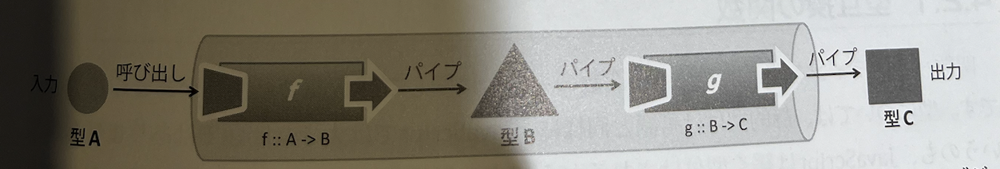

# モジュール化によるコードの再利用 ~ Toward moduler, reusable code

> [!IMPORTANT]
> モジュール性を簡単にいうと、大きなものを小さな部品に分けて作ること。
> ソフトウェア開発の観点からは、コードを理解しやすく、再利用しやすくするために小さなプログラムに分割することを指す。
> ソフトウェアプロダクトにおいて最も重要な品質特性の 1 つと言える。

## メソッドチェーンと関数パイプライン

メソッドチェーンよりも関数パイプラインの方が、柔軟性があるという記載があった。

chatGPT の回答
> [!NOTE]
> ### なぜ関数パイプラインが柔軟性を持つのか？
>
> 1. **関数の独立性と再利用性が高い**
>    - 関数パイプラインで使う各関数は、単独で動作する**純粋関数（pure function）**であることが多いです。純粋関数は、特定の入力に対して常に同じ結果を返し、外部の状態に依存せず副作用を持ちません。これにより、関数を個別にテストしたり、他の場面でも再利用したりすることが容易です。
>    - 例えば、同じ関数を複数のパイプラインや異なる文脈で使い回すことができます。これは、メソッドチェーンではオブジェクトの内部状態に依存するため、再利用性が低くなることがある点と対照的です。
>
> 2. **柔軟な関数の組み合わせ**
>    - 関数パイプラインでは、関数を自由に組み合わせてつなげることができ、異なる処理の流れを簡単に実現できます。各関数は独立しているため、順序を変更したり、特定の関数を挿入・削除するのも簡単です。
>    - メソッドチェーンの場合、特定のメソッドがオブジェクトの内部状態に依存していることが多く、メソッドの順序を変更すると正しい動作が保証されなくなる可能性があります。
>
> 3. **疎結合な設計**
>    - 関数パイプラインでは、各関数は疎結合（loose coupling）です。つまり、各関数が他の関数に依存せず、単に入力を受け取り、出力を返すだけです。このため、個々の関数を変更しても、他の関数に影響を与えにくくなります。
>    - 一方、メソッドチェーンでは、オブジェクトの状態を変更しながらメソッドを呼び出すため、メソッド間の依存性が高くなりやすく、設計が密結合（tight coupling）しやすいです。
>
> ### 具体例で比較
>
> #### 関数パイプライン
> ```javascript
> // 関数を独立して定義
> const add = (x) => x + 5;
> const multiply = (x) => x * 2;
> const subtract = (x) => x - 3;
>
> // pipe関数で組み合わせる
> const pipe = (...fns) => (value) => fns.reduce((acc, fn) => fn(acc), value);
>
> // 柔軟に関数を組み合わせる
> const result = pipe(add, multiply, subtract)(5); // (5 + 5) * 2 - 3 = 17
> console.log(result); // 17
> ```
>
> このように、関数パイプラインでは `add`、`multiply`、`subtract` の順序を簡単に変更したり、関数を追加・削除したりすることができます。また、各関数は他の関数に依存せずに動作します。
>
> #### メソッドチェーン
> ```javascript
> class Calculator {
>   constructor(value = 0) {
>     this.value = value;
>   }
>
>   add(num) {
>     this.value += num;
>     return this;
>   }
>
>   multiply(num) {
>     this.value *= num;
>     return this;
>   }
>
>   subtract(num) {
>     this.value -= num;
>     return this;
>   }
>
>   result() {
>     return this.value;
>   }
> }
>
> const calc = new Calculator(5);
> const result = calc.add(5).multiply(2).subtract(3).result(); // メソッドチェーン
> console.log(result); // 17
> ```
>
> メソッドチェーンでは、`Calculator` オブジェクトの内部状態が `add`、`multiply`、`subtract` メソッドによって変更されていきます。順序を変えることはできますが、クラス全体の構造がオブジェクトに依存しているため、関数単体では再利用が難しく、変更にも注意が必要です。
>
> ### 結論
> 関数パイプラインは、関数が疎結合であり独立しているため、順序の変更や関数の追加・削除が簡単にでき、再利用性やテストのしやすさが高いです。その結果、システム全体の設計が柔軟でメンナンス性が向上します。一方、メソッドチェーンはオブジェクトの状態に依存するため、柔軟性に欠けることがありますが、オブジェクト指向的な操作が必要な場合には便利です。
>
> 関数パイプラインが「柔軟性がある」と言われるのは、これらの理由からです。

## メソッドチェーンと関数パイプラインの違い


メソッドチェーンは、オブジェクトの状態に依存しているので純粋関数とは言えない。
純粋関数ではないということは、テストがしにくく、再利用性も低い。



関数パイプラインは、純粋関数であることが多く、再利用性が高い。
また依存するのは、引数のみなので引数の数と型さえあっていれば、どのような関数でも組み合わせが可能。
ただ Javascript には、パイプライン演算子がないので、パイプライン処理を行う関数を自作する必要がある。

## 互換性の関数

> [!IMPORTANT]
> 関数型プログラミングにおける「互換性」とは、関数同士を組み合わせ使う際に、正しく動作するための条件や性質を指す。
> 関数を組み合わせる時に、関数同士の入出力で **型** と **引数の数** が一致していることが重要。

##  関数とアリティ

アリティとは、**関数が受け取る引数の数** を指す。
引数の数が少ないほど、使い方が簡単で組み合わせやすく、再利用性が高い。
できるだけ、単一の引数を取る純粋関数を作ることが望ましいが、簡単ではない。
関数のアリティを減らす方法として **タプル** と **カリー化** がある。

### タプル

タプルとは、**有限かつ順番に並べられたリスト** のこと。
関数の戻り値でオブジェクトや配列を返すよりも、次の点でメリットがある。

- 不変性: 一度作成されると、内部データを変更できない
- 一時的な型を作らなくて良い: タプルは互いに全く関係ない値同士を関連づけることができる。データ一緒にグループ化するためだけの型を定義し、インスタンス化することは、モデルを必要以上に複雑化させる。
- 異種混合の配列を作らなくて良い: タプルは異なる型の値を持つことができる。配列は同じ型の値しか持てない。


> [!IMPORTANT]
> Javascript には、標準でタプルがない

以下のようにユーザー独自のタプルを実装することができる。

```javascript
// タプルの実装
const Tuple = function(/* types */) {
    const typeInfo = Array.prototype.slice.call(arguments, 0)

    const _T = function(/* values */) {
        const values = Array.prototype.slice.call(arguments, 0)
        if (values.some(val => val === null || val === undefined)) {
            throw new ReferenceError('Tuples may not have any null values')
        }

        if (values.length !== typeInfo.length) {
            throw new TypeError('Tuple arity does not match its prototype')
        }

        values.map((val, index) => {
            this['_' + (index + 1)] = checkType(typeInfo[index])(val)
        }, this)

        Object.freeze(this)
    }

    _T.prototype.values = () => {
        return Object.keys(this).map(k => this[k], this)
    }

    return _T
}

const Status = Tuple(Boolean, String)

new Status(true, 'hello')
new Status(false, 'world')
```

> [!NOTE]
> Javascript の配列で違う型を持つ値を扱うことができ、typescript を使えば配列の各要素に型指定できるのでタプルを自作する必要はなさそう。
> ただ上記の Tuple の実装は、アリティ（長さ）を固定でき、変更不可能なデータ構造を作ることができているので、より厳密なデータ管理を行いたい場合は、有効な手段となる。

### カリー化

> [!IMPORTANT]
> カリー化とは、引数が複数ある関数を、引数を 1 つずつ受け取る関数に変換すること
> そのため複数の引数を受け取る 1 つの関数を複数の単一の引数を受け取る関数に分割することができる。
> 関数型プログラミングでは、引数を一般化して、再利用性を高めることが重要であるため、カリー化は有用な手法となる。

```javascript
// カリー化前
function add(x, y) {
    return x + y
}

// カリー化後

function add(x) {
    return function(y) {
        return x + y
    }
}

const addTwo = add(2)
addTwo(3) // 5
```

カリー化を行うことで 1 部の引数を先に固定して、後で必要に応じて残りの引数を渡すことで、関数の再利用性が高まる。
例えば、ある引数が特定の値で固定される状況が多い場合、その部分を先にカリー化してしまえば、毎回同じ引数を渡さなくて良くなる。

### 関数ファクトリのエミュレート

オブジェクト指向の世界では、インターフェースを利用して、オブジェクトの振る舞いを変更できる。
これは **ファクトリメソッドパターン** と呼ばれ、コードの呼び出し側では、メソッドの呼び出しのみを行い、内部の実装を意識する必要がない。

Java でファクトリメソッドパターンを実装すると以下のようになる。

```java
public interface StudentStore {
    Student findStudent(String ssn);
}

public class DbStudentStore implements StudentStore {
    public Student findStudent(String ssn) {
        // データベースから学生情報を取得する処理
    }
}

public class CacheStudentStore implements StudentStore {
    public Student findStudent(String ssn) {
        // キャッシュから学生情報を取得する処理
    }
}
```

findStudent を呼び出す側は、どこからデータを取得しているか意識する必要がない。
このファクトリーメソッドパターンをカリー化を使ってエミュレートしてみる。

```javascript
const fetchStudentFromDb = R.curry(function (db, ssn) {
    return find(db, ssn)
})

const fetchStudentFromArray = R.curry(function (array, ssn) {
    return arr[ssn]
})

const fetchStudent = useDb ? fetchStudentFromDb(db) : fetchStudentFromArray(array)
findStudent('444-44-4444');
```

汎用的な findStudent により、関数定義と評価を分離できる。

### 関数テンプレートの実装

アプリケーション内でエラー・警告・デバッグなどの様々な状況で異なるログ機能を設定することを考える。
そして標準の `console.log` ではなく、 ログフレームワークのライブラリ `Log4js` を使用して実装する。
この `Log4js` は設定可能な項目が多く、直接呼び出してしまうとアプリケーション全体でコードの重複があちこちで発生してしまう。よって再利用可能な関数テンプレートを定義して、コードの重複を減らす。

```javascript
const logger = function(appender, layout, name, level, message) {
    const appenders = {
        'alert': new Log4js.JSAlertAppender(),
        'console': new Log4js.BrowserConsoleAppender(),
    }
    const layouts = {
        'basic': new Log4js.BasicLayout(),
        'json': new Log4js.JSONLayout(),
        'xml': new Log4js.XMLLayout()
    }
    const appender = appenders[appender]
    appender.setLayout(layouts[layout])
    const logger = Log4js.getLogger(name)
    logger.addAppender(appender)

    logger.log(level, message, null);
}

const log = R.curry(logger)('alert', 'json', 'FJS');
log("ERROR", "Error condition detected!!")

const logError = log('ERROR')
logError('Error code 404 detected!!')
logError('Error code 402 detected!!')
```

このコードを実行すると `logger` 関数に対して `curry` が呼び出され、最終的に単項関数が作成される。
関数に任意の個数のパラメータを渡せるのは、引数の定義されたタイミングで関数を段階的に構築することができる。

> ![IMPORTANT]
> カリー化が行っているのは、複数の引数を取る関数 ( 多引数関数 ) を、1 つの引数を取る関数 ( 単項関数 ) に変換することである。

## 部分適用とパラメータ束縛

**部分適用は、非可変個の引数を取る関数のパラメータの一部を固定値に初期化して、アリティがより小さい関数を返すことである。**
例えば、5 つの引数を取る関数がある場合、そのうち 3 つの引数を固定して、残りの 2 つの引数を取る関数を作成することができる。

カリー化は、引数を 1 つずつ受け取る関数に変換し、部分適用は、関数の引数の一部を固定して、新しい関数を作成する。

```javascript
function partial () {
    let fn = this, boundArgs = Array.prototype.slice.call(arguments)
    let placeholder = <<partialPlaceholderObj>>
    let bound = function () {
        let position = 0, length = boundArgs.length
        let args = Array(length)
        for (let i = 0; i < length; i++) {
            args[i] = boundArgs[i] === placeholder ? arguments[position++] : boundArgs[i]
        }
        while (position < arguments.length) {
            args.push(arguments[position++])
        }
        return fn.apply(this, args)
    }
}
```

## 参考
[超強力な関数型プログラミング用ライブラリ Ramda.js を学ぼう #1 - これから始める人のための導入編](https://techblog.recruit.co.jp/article-560/)
